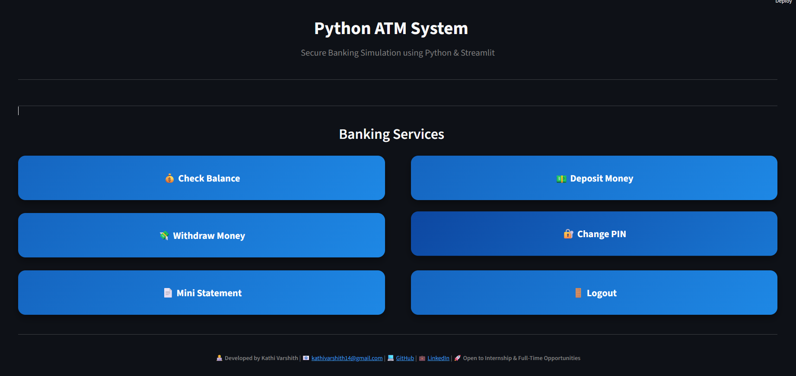
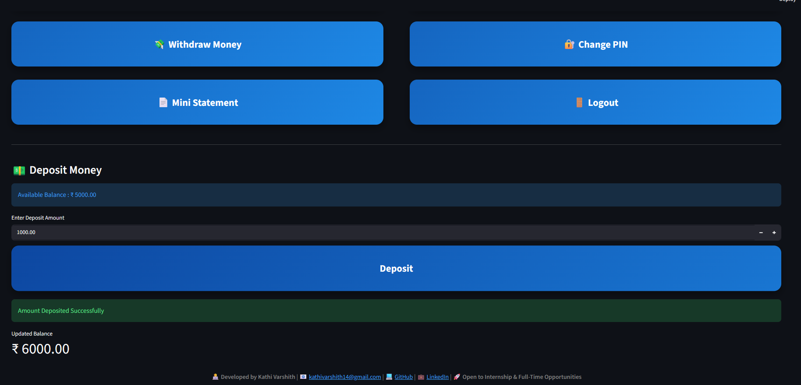

# ATM-SYSTEM_GUI
A modern ATM Banking System built using Python and Streamlit with features like secure PIN authentication, balance inquiry, deposit, withdrawal, PIN management, and mini statements.
# 🏧 Python ATM System

A modern ATM Banking System built using **Python** and **Streamlit** that simulates the core functionalities of an ATM through an interactive web interface.


---

## 📌 Overview

The Python ATM System is a simple banking simulation that allows users to perform common ATM operations such as checking balance, depositing money, withdrawing money, changing their PIN, and viewing a mini statement. The project was initially developed as a Python console application and later enhanced into a modern web application using Streamlit.

---

## ✨ Features

- 🔐 Secure PIN Authentication
- 💰 Check Account Balance
- 💵 Deposit Money
- 💸 Withdraw Money
- 🔑 Change PIN
- 📄 Mini Statement
- 📊 Real-Time Balance Updates
- 🎨 Modern Banking User Interface
- 📱 Responsive Web Application

---

## 🛠️ Technologies Used

- Python
- Streamlit
- HTML & CSS (Custom Styling)
- Session State Management

---

## 📂 Project Structure

```text
Python-ATM-System/
│
├── app.py
├── styles.css
├── requirements.txt
├── README.md
├── .gitignore
│
└── assets/
    └── atm_logo.png
```

---

## 🚀 Installation

### Clone the repository

```bash
git clone https://github.com/Kathivarshith/Python-ATM-System.git
```

### Navigate to the project

```bash
cd Python-ATM-System
```

### Install dependencies

```bash
pip install -r requirements.txt
```

### Run the application

```bash
streamlit run app.py
```

---

## 📸 Application Preview

## 📸 Application Screenshots

### 🔐 Login Page


### 🏠 Dashboard



### 💰 Check Balance


### 💵 Deposit Money



### 💸 Withdraw Money


### 🔑 Change PIN


### 📄 Mini Statement


## 🚀 Future Improvements

- 👥 Multiple User Accounts
- 🗄️ SQLite Database Integration
- 🧾 Transaction Receipt Generation
- 📥 Download Mini Statement as PDF
- 🌙 Dark & Light Theme
- 📊 Transaction Analytics Dashboard
- 📱 Mobile-Friendly UI
- ☁️ Cloud Database Integration

---

## 🌐 Live Demo

**Coming Soon...**

(After deploying to Streamlit, replace this with your live app URL.)

---

## 👨‍💻 Developer

**Kathi Varshith**

📧 Email: kathivarshith14@gmail.com

💻 GitHub: https://github.com/Kathivarshith

💼 LinkedIn: https://www.linkedin.com/in/kathi-varshith1114/

🚀 **Open to Internship & Full-Time Opportunities**

---

## ⭐ Support

If you found this project helpful, please consider giving it a ⭐ on GitHub.

Feedback and suggestions are always welcome!
